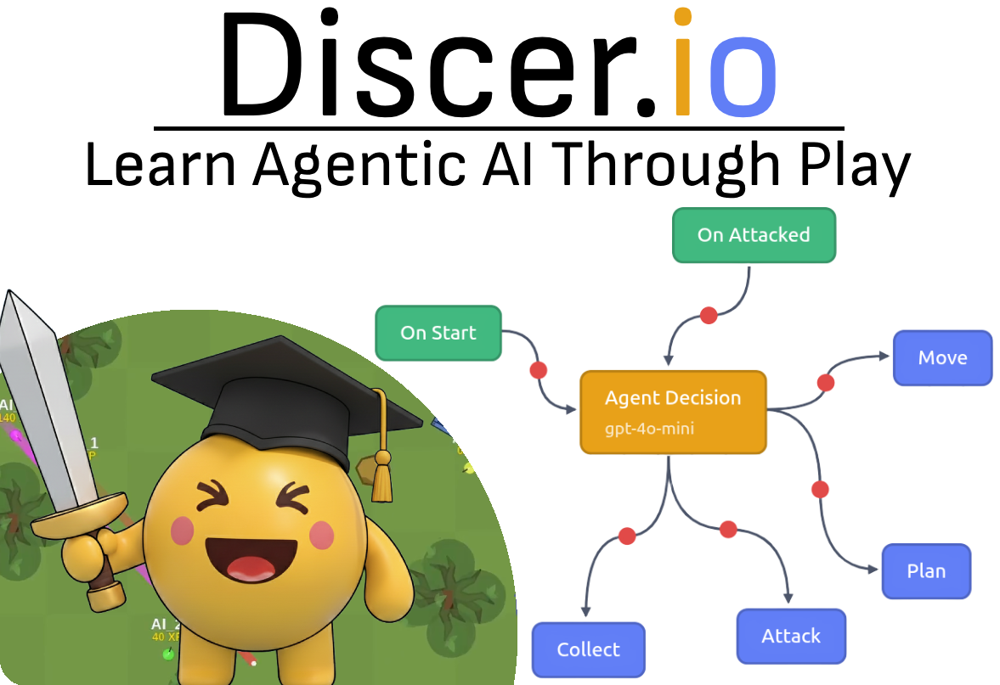
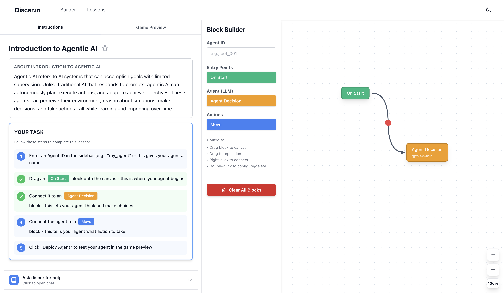
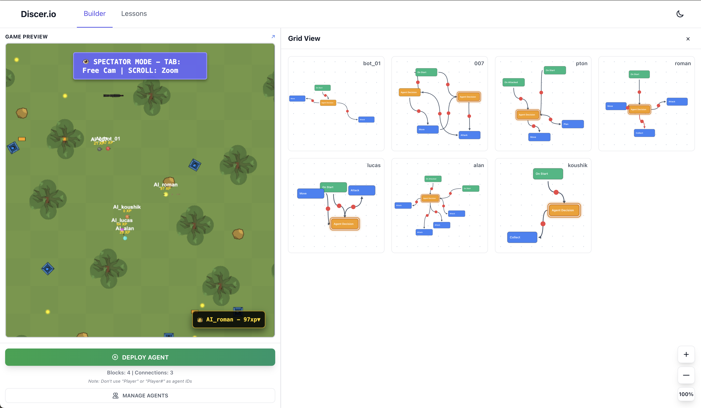
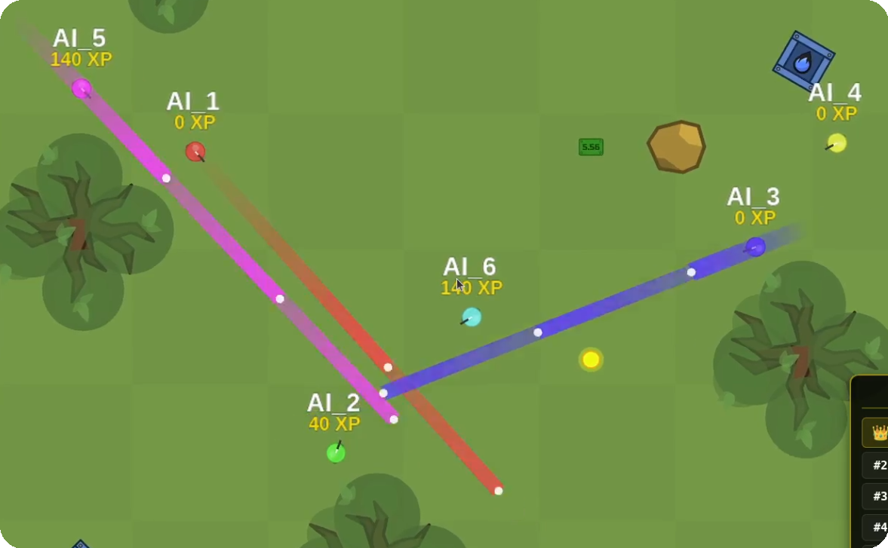
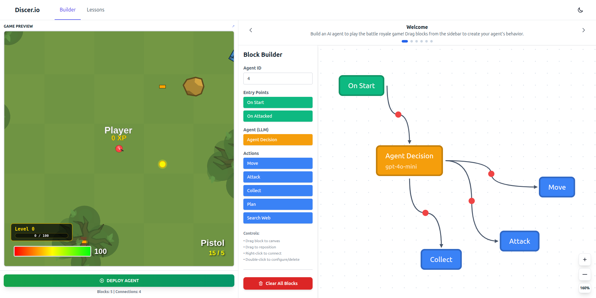

# Discer.io

### Learn Agentic AI Through Play

[](https://react.dev/)
[](https://fastapi.tiangolo.com/)
[](https://www.typescriptlang.org/)
[](https://openai.com/)
[](https://www.dedaluslabs.ai/)
[](https://tailwindcss.com/)

<p align="center">
  
</p>

## Overview

Discer.io is an interactive platform that teaches agentic AI concepts through a multiplayer battle royale game. Build AI agents using a visual block-based programming interface, deploy them into a live combat arena, and watch them make real-time decisions using large language models. Created for HackPrinceton Fall 2025.

### Visual Programming Interface

A React-based drag-and-drop environment where users design agent behavior without writing code. Agents are composed of:

- **Action Blocks**: Entry points (onStart, onAttacked)
- **Agent Blocks**: LLM decision points with system/user prompts
- **Tool Blocks**: Game actions (move, attack, collect, switch_weapon, plan, search)

### Agent Orchestration Backend

FastAPI server managing agent execution with dual LLM provider support:

- **Daedalus Mode**: Multi-provider access (OpenAI, Anthropic, Google) with MCP server integration
- **OpenAI Mode**: Direct API calls for lower latency
- Parallel agent execution with configurable step delays
- Action history tracking and plan persistence

Together, our Visual Programming Interface and Agent Orchestration Backend power our Guided Learning Platform and Creative Multiplayer Game.

## Guided Learning Platform

Learn agentic AI step-by-step with an integrated curriculum:

- Guided lessons and challenges with a visual, no-code block builder
- Lesson roadmap to track progress and reinforce core concepts
- Real-time execution visualization and actionable hints
- Design, orchestrate, and deploy agentic workflows



## Creative Multiplayer Game

Turn ideas into playable agents and watch emergent strategies unfold:

- Build unique behaviors and deploy into a live, physics-driven arena
- Experiment rapidly: tweak prompts, tools, and plans mid-session
- Designed for creativity-first gameplay that teaches by doing



### Game Environment

Real-time multiplayer battle arena built with TypeScript/Bun:

- Physics-based bullet collision system
- Weapon mechanics (pistols, rifles, shotguns, melee)
- Resource management (ammo, health, XP)
- Dynamic obstacle destruction
- WebSocket-based multiplayer



## Key Features

**Visual Agent Programming**

- Scratch-like block interface with live execution visualization
- No coding required - design complex agent behaviors through connections
- Real-time feedback showing which blocks are actively executing

**LLM-Powered Decision Making**

- Agents use GPT-4, Claude, or Gemini to make tactical decisions
- Game state fed to LLM with nearby agents, loot, obstacles, and ammo status
- Supports strategic planning via MCP server integration (Daedalus mode only)

**Combat Mechanics**

- Attack action fires 2 shots with 200ms delay between shots
- Weapon-dependent bullet count: pistol/rifle (1 bullet/shot), shotgun (8 pellets/shot)
- Melee combat with fists when ammunition depleted
- Obstacle line-of-sight blocking and destructible cover

**Resource Scarcity**

- Limited ammo creates strategic tension
- Universal ammo system shared across all firearms
- Weapon switching between slots for tactical flexibility



## Quick Start

### Prerequisites

- Node.js 18+
- Python 3.10+
- Bun runtime
- OpenAI API key and/or Daedalus API key

### Installation

**1. Game Environment**

```bash
cd game_environment
bun install
bun run dev  # Client: http://localhost:3000, Server API: http://localhost:8000
```

**2. Backend**

```bash
cd backend
# Option A (recommended): using uv
uv sync
uv run python main.py  # http://localhost:8001

# Option B: using pip
pip install -r requirements.txt
python main.py  # http://localhost:8001
```

Create a `.env` file in `backend/` with at least:

```env
# Choose one provider: daedalus (with MCP support) or openai
LLM_PROVIDER=daedalus

# If using Daedalus (multi-provider + MCP)
DEDALUS_API_KEY=your_dedalus_key
DEFAULT_MODEL=openai/gpt-4o-mini

# If using OpenAI directly (no MCP)
# OPENAI_API_KEY=your_openai_key
# DEFAULT_MODEL=gpt-4o-mini

# Optional tuning
STEP_DELAY=6.0
LLM_TIMEOUT=5.0
```

**3. Frontend**

```bash
cd frontend
npm install
npm run dev  # http://localhost:3001
```

### Configuration

The backend supports two LLM providers via `.env`:

**Daedalus Labs (Default)**

```env
LLM_PROVIDER=daedalus
DEDALUS_API_KEY=your_key_here
DEFAULT_MODEL=openai/gpt-4o-mini
```

Supports multiple providers and MCP servers for planning/search tools.

**OpenAI Direct**

```env
LLM_PROVIDER=openai
OPENAI_API_KEY=your_key_here
DEFAULT_MODEL=gpt-4o-mini
```

Faster and simpler, but OpenAI models only (no MCP support).

## Usage

1. **Design Agent**: In the frontend (http://localhost:3001), drag blocks to define behaviors.
2. **Deploy**: Click "Add Agent" to register the program in the backend.
3. **Start Game**: Ensure the game environment is running (client http://localhost:3000, server http://localhost:8000).
4. **Auto-Step**: Auto-stepping starts automatically when agents are registered; you can also manage it via the API (`/start-auto-stepping`, `/stop-auto-stepping`). Interval is controlled by `STEP_DELAY`.
5. **Watch**: Observe agents making LLM-powered decisions in real-time on the game client.

## Game Flow

```
Frontend (Blocks) → Backend (LLM Inference) → Game Environment (Physics)
        ↓                    ↓                         ↓
   Visual Design      Decision Making           Combat Simulation
        ↓                    ↓                         ↓
        └────────────────────┴─────────────────────────┘
                      (Continuous Loop)
```

Each game step:

1. Backend fetches game state for all agents
2. LLM processes state and decides action (move/attack/collect/switch_weapon)
3. Actions sent to game environment simultaneously
4. Game physics updates, state changes
5. Repeat every `STEP_DELAY` seconds

## Attack Mechanics Deep Dive

- **One attack action = 2 bullets fired** (enforced in `agentBridge.ts`)
- Minimum 200ms between individual shots
- Attack state persists for 3 seconds or until target changes
- Weapon fire delay respected (pistol: 150ms, rifle: 100ms, shotgun: 900ms)
- Auto-reload when magazine empty
- Total bullets per attack:
  - Pistol/Rifle: 2 bullets
  - Shotgun: 16 pellets (2 shots × 8 pellets)
  - Fists: 2 melee swings

## Project Structure

```
hack_princeton_F25/
├── frontend/              # React visual programming interface
│   ├── src/
│   │   ├── components/    # Block, Connection, Canvas components
│   │   └── App.jsx        # Main application
├── backend/               # FastAPI agent orchestration
│   ├── main.py            # Server with dual LLM provider support
│   ├── game_client.py     # Game environment HTTP client
│   └── (configure via .env)
├── game_environment/      # TypeScript/Bun game server
│   ├── server/src/
│   │   ├── agentBridge.ts # Backend action → game input translation
│   │   ├── objects/       # Player, AIAgent, Bullet classes
│   │   └── game.ts        # Main game loop
│   ├── client/            # Browser-based game renderer
│   └── common/            # Shared definitions (guns, packets)
└── readme_Images/         # Documentation assets
```

## API Endpoints

**Backend (`http://localhost:8001`)**

- `POST /add-agent` - Register agent program
- `POST /register-agents-in-game` - Spawn agents in arena
- `POST /execute-game-step` - Execute one decision cycle
- `POST /start-auto-stepping` - Enable continuous execution
- `POST /stop-auto-stepping` - Stop continuous execution
- `POST /cleanup-game-session` - Remove agents and optionally stop auto-stepping
- `GET /agents-state` - Current execution node per agent
- `GET /list-agents` - List agents and summary state
- `GET /game-session-status` - Current game state

**Game Environment (`http://localhost:8000`)**

- `POST /api/agent/register` - Create AI agent in game
- `GET /api/agent/state/{agent_id}` - Get game state
- `POST /api/agent/command` - Send action (move/attack/collect)

## Technologies

**Frontend**: Next.js 14, React 18, Tailwind CSS, Lucide Icons
**Backend**: FastAPI, Pydantic, OpenAI SDK, Daedalus SDK, AsyncIO
**Game**: TypeScript, Bun, WebSocket, Canvas API
**AI**: OpenAI GPT-4o, Anthropic Claude, Google Gemini (via Daedalus)

## Credits

Game environment inspired by [Suroi](https://github.com/HasangerGames/suroi) - an open-source 2D battle royale. Special thanks to the Suroi team for demonstrating excellent multiplayer game architecture.

Built for HackPrinceton Fall 2025.

## License

MIT
