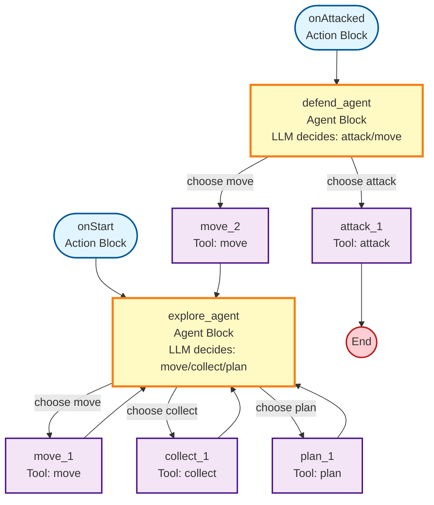

# Agents Backend

Backend API for MMO game with agent-controlled players using drag-and-drop block programming.

## Setup

Install dependencies using `uv`:

```bash
uv sync
```

## Running the Server

```bash
uv run python main.py
```

The server will start on `http://localhost:8000`.

API documentation is available at `http://localhost:8000/docs`.

## API Endpoints

### Health Check

```bash
curl http://localhost:8000/
```

**Response:**
```json
{
  "status": "healthy",
  "service": "agents-backend",
  "agents_count": 0
}
```

---

### Add Agent

`POST /add-agent`

Add a new agent with its Scratch-like program to the game.

**Example: Simple Loop**

```bash
curl -X POST http://localhost:8000/add-agent \
  -H "Content-Type: application/json" \
  -d '{
  "agent_id": "player_123",
  "blocks": [
    {
      "id": "on_start",
      "type": "action",
      "action_type": "onStart",
      "next": "decide_action"
    },
    {
      "id": "decide_action",
      "type": "agent",
      "model": "openai/gpt-5",
      "system_prompt": "You are controlling a game character in an MMO.",
      "user_prompt": "Choose your next action based on the situation.",
      "tool_connections": [
        {"tool_id": "move_tool", "tool_name": "move"},
        {"tool_id": "attack_tool", "tool_name": "attack"}
      ]
    },
    {
      "id": "move_tool",
      "type": "tool",
      "tool_type": "move",
      "parameters": {"x": "number", "y": "number"},
      "next": "decide_action"
    },
    {
      "id": "attack_tool",
      "type": "tool",
      "tool_type": "attack",
      "parameters": {"target_player_id": "string"},
      "next": "decide_action"
    }
  ]
}'
```

**Response:**
```json
{
  "success": true,
  "agent_id": "player_123",
  "current_node": "decide_action",
  "message": "Agent 'player_123' added successfully"
}
```

**Example: Complex Program with Multiple Entry Points**

```bash
curl -X POST http://localhost:8000/add-agent \
  -H "Content-Type: application/json" \
  -d '{
  "agent_id": "player_456",
  "blocks": [
    {
      "id": "on_start",
      "type": "action",
      "action_type": "onStart",
      "next": "explore_agent"
    },
    {
      "id": "on_attacked",
      "type": "action",
      "action_type": "onAttacked",
      "next": "defend_agent"
    },
    {
      "id": "explore_agent",
      "type": "agent",
      "model": "openai/gpt-5",
      "system_prompt": "You are exploring the world peacefully.",
      "user_prompt": "What do you want to do?",
      "tool_connections": [
        {"tool_id": "move_1", "tool_name": "move"},
        {"tool_id": "collect_1", "tool_name": "collect"},
        {"tool_id": "plan_1", "tool_name": "plan"}
      ]
    },
    {
      "id": "defend_agent",
      "type": "agent",
      "model": "openai/gpt-5",
      "system_prompt": "You are under attack! Defend yourself.",
      "user_prompt": "Choose your defensive action.",
      "tool_connections": [
        {"tool_id": "attack_1", "tool_name": "attack"},
        {"tool_id": "move_2", "tool_name": "move"}
      ]
    },
    {
      "id": "move_1",
      "type": "tool",
      "tool_type": "move",
      "parameters": {"x": "number", "y": "number"},
      "next": "explore_agent"
    },
    {
      "id": "move_2",
      "type": "tool",
      "tool_type": "move",
      "parameters": {"x": "number", "y": "number"},
      "next": "explore_agent"
    },
    {
      "id": "collect_1",
      "type": "tool",
      "tool_type": "collect",
      "parameters": {},
      "next": "explore_agent"
    },
    {
      "id": "plan_1",
      "type": "tool",
      "tool_type": "plan",
      "parameters": {"plan": "string"},
      "next": "explore_agent"
    },
    {
      "id": "attack_1",
      "type": "tool",
      "tool_type": "attack",
      "parameters": {"target_player_id": "string"},
      "next": null
    }
  ]
}'
```

**Visual Flow Diagram:**



---

### Next Step for Agents

`POST /next-step-for-agents`

Execute the next step for an agent based on the current game state. This endpoint uses Dedalus SDK to call the LLM and decide which tool/action the agent should take.

**Example: Normal Execution**

```bash
curl -X POST http://localhost:8000/next-step-for-agents \
  -H "Content-Type: application/json" \
  -d '{
    "agent_id": "player_123",
    "game_state": {
      "position": {"x": 10.5, "y": 20.3},
      "health": 85,
      "inventory": ["sword", "shield"],
      "nearby_agents": [
        {"id": "enemy_1", "distance": 5.2}
      ]
    }
  }'
```

**Response:**
```json
{
  "agent_id": "player_123",
  "action": {
    "tool_type": "move",
    "parameters": {
      "x": 5,
      "y": -2
    }
  },
  "current_node": "decide_action"
}
```

**Example: With Action Trigger (e.g., "attacked")**

When an action occurs (like being attacked), you can trigger the corresponding entry point:

```bash
curl -X POST http://localhost:8000/next-step-for-agents \
  -H "Content-Type: application/json" \
  -d '{
    "agent_id": "player_456",
    "game_state": {
      "position": {"x": 15.0, "y": 25.0},
      "health": 60,
      "nearby_agents": [
        {"id": "attacker_1", "distance": 2.0}
      ]
    },
    "action_occurred": "attacked"
  }'
```

**Response:**
```json
{
  "agent_id": "player_456",
  "action": {
    "tool_type": "attack",
    "parameters": {
      "target_player_id": "attacker_1"
    }
  },
  "current_node": "explore_agent"
}
```

**Notes:**
- The `game_state` field is flexible and can contain any fields your game needs
- The `action_occurred` field is optional and currently supports `"attacked"`
- The LLM will choose which tool to use based on the game state and available tools
- The LLM also generates appropriate parameters for the chosen tool based on the parameter schema
- The agent's `current_node` is automatically updated after execution

**Tool Parameter Requirements:**
- `move`: Requires `x` (number) and `y` (number) - relative coordinates for movement
- `attack`: Requires `target_player_id` (string) - ID of the player to attack
- `collect`: No parameters required
- `plan`: Requires `plan` (string) - the strategic plan text

## Block Types

### Action Block
Entry points for agent execution:
- `onStart`: Executes when the agent is first added
- `onAttacked`: Executes when the agent is attacked

### Agent Block
Makes LLM-based decisions:
- Calls the specified model with system and user prompts
- Returns which tool to execute with appropriate parameters
- Can connect to multiple tool blocks (conditional branching)
- The LLM receives parameter schemas for each available tool

### Tool Block
Executes game actions with optional parameters:
- `move`: Move the agent (requires x, y coordinates)
- `attack`: Attack another agent (requires target_player_id)
- `collect`: Collect resources (no parameters)
- `plan`: Strategic planning (requires plan text)
- Each tool block defines its parameter schema using the `parameters` field

## Schema Notes

- All block IDs must be unique within a program
- At least one `onStart` action block is required
- Agent blocks must have at least one tool connection
- Tool and action blocks can only connect to one next block
- Agent blocks can connect to multiple tool blocks for branching logic
- Cycles are supported (e.g., tool � agent � tool creates a loop)
- Tool blocks can define parameter schemas (key-value pairs where key is parameter name and value is type description)
- The LLM will generate parameter values based on the game state and parameter schemas
